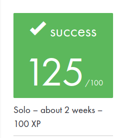

# docker-1
First project on the [Docker](https://www.docker.com/) ecosystem. Learn to think in containers through this subject in which you will handle docker binary and create your first containers with Dockerfiles.

* [Introduction](./README/intro.md)
* [Docker Swarms](./README/swarms.md)
* [Docker Services](./README/services.md)
* [Overlay Networks](./README/overlay_networks.md)
* [Dockerfiles](./README/dockerfiles.md)
* [00. How to docker](./README/00_how_to_docker.md)
* [01. Dockerfiles](./README/01_dockerfiles.md)
* [02. Bonus](./README/02_bonus.md)

---
[:arrow_backward:][back] ║ [:house:][home] ║ [:arrow_forward:][next]

<!-- navigation -->
[home]: #
[back]: #
[next]: ./README/intro.md