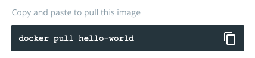
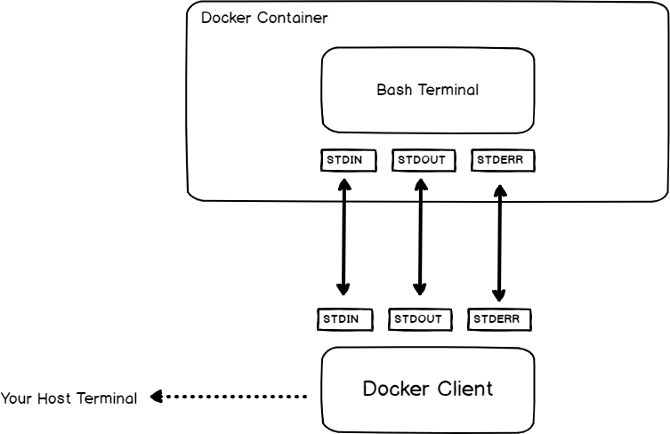

# 00. How to docker
For this part we just have to write Docker commands into files (no need to make them executable).

## Exercise 1
For this exercise we have to: Get the [hello-world](https://hub.docker.com/_/hello-world) container from the [Docker Hub](https://hub.docker.com).

As we mentioned in our introduction, **Docker Hub** is an important part of the Docker ecosystem. If we visit the site, we can **search** for any image available in the repository. Typing `hello world` takes us to the *hello world's* **official image**, so we just have to copy the command and paste it in our terminal.



That will **download** the hello world **image** to some location in our disk. To verify that we downloaded the `hello-world` image to our disk, we can run:
```
docker images
```

 This location depends on the **host** where we're using Docker:
* In a Linux host, images are stored in `/var/lib`
* In a macOS host, Docker stores images in a single, large disk image (64 GB on my system) under:
```
~/Library/Containers/com.docker.docker/Data/vms/0/data/Docker.raw
```

## Exercise 2
For this task we have to: **Launch** the hello-world **container**, and make sure that it prints its welcome message, then leaves it.

This is fundamental to understand the idea of **spinning** a **container** our of an **image**. We use the `docker run image-name` for that. But how do we know what's the exact **name of the image**? Well, you can use:
```
docker images
REPOSITORY    TAG       IMAGE ID       CREATED        SIZE
hello-world   latest    feb5d9fea6a5   5 months ago   13.3kB
```

## Exercise 3
Launch a [nginx container](https://hub.docker.com/_/nginx), available on Docker Hub.

1. It should be run as a **background** task.
2. It should be named `overlord`.
3. It should be able to **restart** on its own.
4. It should have its `80` port attached to the `5000` port of your machine. You can check that your container functions properly by visiting http://localhost:5000 on your web browser.

1. To run a container in the [background](https://docs.docker.com/engine/reference/run/#detached-vs-foreground) (so we don't lose access to our command prompt) we should use `-d=true` or just `-d`.
2. To [name](https://docs.docker.com/engine/reference/run/#name---name) a container: `--name overlord`.
3. To make it [restart](https://docs.docker.com/config/containers/start-containers-automatically/) we have to use the flag `--restart` with the `always` policy.
4. To make a port available to services outside of Docker, or to Docker containers which are not connected to the container’s network, use the `--publish` or `-p` flag. This creates a **firewall rule** which maps a container port to a port on the Docker host to the outside world. This is known as [publishing ports](https://docs.docker.com/config/containers/container-networking/). The syntax is:
`-p host_port:container_port`.

> At the end of all the options, we have to specify the **image name** (in this case `nginx`). If the `nginx` image is not found **locally**, it'll be automatically pulled from **Dockerhub** to our machine, and spins a **container** based on that image.

To check that `nginx` is running, we could execute `docker ps` (to access the list of **running containers**), or we could just open our web browser and point it to http://localhost:5000. That should show the default **Welcome to nginx!** web site.

## Exercise 4
To get the **internal IP** address of the ``overlord`` **container** without starting its shell and
using only one command, we have two options:

* `docker container inspect container_name`
* `docker inspect container_name`

That will produce all the **container information** as a [JSON](https://en.wikipedia.org/wiki/JSON) object. In order to extract the information regarding the **internal IP** we can use the `--format` option (`-f` for short), followed by a [Go template](https://pkg.go.dev/text/template), that allows us to manipulate the output.

> A Go template is just two sets of curly braces, as in `{{.someProperty}}`` that must be wrapped in **single quotes** in order to escape its meaning in our shell ([brace expansion](https://www.gnu.org/software/bash/manual/html_node/Brace-Expansion.html).

Since the output was a bit overwhelming, I decided to redirect it to a file named `overlord.json`, and study it carefully in my text editor. Then it was a matter of locating the **nested object** named `NetworkSettings`, and then access its `IPAddress` property using **dot notation**.

## Exercise 5
For this exercise we have to:

1. Launch a shell in an [alpine](https://hub.docker.com/_/alpine) container.
2. This shell must be **interactive**.
3. The **container** must delete itself when we **log out** of the shell.

1. [Alpine Linux](https://alpinelinux.org/) is a security-oriented, lightweight Linux distribution. We can `pull` its official **image** from **Docker Hub**, while at the same time **spin** a container using `docker run alpine`.
2. Since we must interact with the shell, we'll have to use the ``--interactive`` option (`-i` for short) plus allocate a pseudo-TTY using the ``--tty`` option (``-t`` for short).
3. In order to [clean up](https://docs.docker.com/engine/reference/run/#clean-up---rm) the container upon finishing execution, we'll use the ``--rm`` flag.

According to the documentation, a Docker container that runs in foreground mode will only have its **standard output stream** (`STDOUT`) and **standard error stream** (`STDERR`) attached if we don’t add the ``-a`` option. That's because those are the only necessary streams to output stuff, or return the return value (`0` if all went OK).



We can run a **shell process** in two modes:

* In **non-interactive mode**, the shell executes the script passed to it and exits (we'd use `docker exec` for this).
* In **interactive mode**, the shell listens to the commands through the **standard input stream** (`STDIN`) on a terminal.

## Exercise 6
For this exercise we have to:

1. Launch a [Debian](https://hub.docker.com/_/debian) container.
2. Make sure that the **package manager** and the **packages** already in the container are updated.
3. Install via the container’s package manager everything you need to compile C source code and push it onto a git repo.

For this exercise, we should **only** specify the commands to be run directly in the container, which implies we must launch an **interactive** Debian container:
```
docker run -it --rm debian /bin/bash
```

Then it's a matter of installing `git`, a compiler such as `gcc`, and a build tool like `make`; in short, all the necessary stuff to compile C code.

## Exercise 7
In this exercise we're asked to create a **volume** named `hatchery`.

> [Volumes](https://docs.docker.com/storage/volumes/) are the preferred mechanism for persisting data **generated by** and **used by** Docker **containers**. While [bind mounts](https://docs.docker.com/storage/bind-mounts/) are dependent on the directory structure and OS of the host machine, volumes are completely managed by Docker.

Basic commands regarding volumes are:

* To **create a volume** we use the `docker volume create` command, followed by the name we want to give the volume.
* To **list all existing volumes** we use the `docker volume ls` command, which can be useful to verify we've created one.
* To **inspect a volume** we use `docker volume inspect`,  followed by the name of the volume we want to inspect.
* To **remove a volume** we use `docker volume rm`,  followed by the name of the volume we want to remove.

## Exercise 8
In this one we're asked to **list** all the Docker volumes created on the machine (Just read above).

## Exercise 9
This exercise is a bit more involved; we have to:

1. Launch a `mysql` container as a **background** task.
2. The container has to be named `spawning-pool`.
3. It should be able to **restart** on its own in case of **error**.
4. The container directly creates a **database** named `zerglings`.
5. The **root password** of the database should be `Kerrigan`.
4. The database is stored in the `hatchery` volume.

1. To launch a `mysql` container we'll use `docker run mysql`, which takes care of downloading the [official mysql image](https://hub.docker.com/_/mysql) if it doesn't exist in our system. Since it has to run as a **background** process, we'll use the `-d=true` (or `-d` for short).
2. To name a **container** we use the `--name` option, followed by the name.
3. To make it **restart** automatically on failure we can use the `--restart` option with the `on-failure` value. It's quite convenient to limit the number of times the Docker daemon attempts to restart the container using the `:max-retries` option. If we keep trying to restart the container **indefinitely**, it could possibly lead to a **denial of service** on the host. So a good idea is to set the value of `:max-retries` to `5`, hence `on-failure:5`.
4. From the [official mysql image](https://hub.docker.com/_/mysql) page on **Docker Hub**, we learn that there are several **environment variables** that we can use to configure the MySQL instance. To set the **database name** we can use the `MYSQL_DATABASE` variable. One of the options we can use with `docker run` is `--env` (or `-e` for short), followed the the variable we want to set.
5. To set the **root password** we can use the `MYSQL_ROOT_PASSWORD`.
6. Finally, to store the database in the `hatchery` volume we have a couple of choices:

* The `--volume` flag (`-v` for short).
* The `--mount` flag, more explicit and verbose.

The `-v` flag consists of **three fields** separated by **colon characters** (`:`), in the following order:

* **Name of the volume**, which can be omitted if we're content with an **anonymous volume**.
* The **path** where the volume is mounted in the **container**. We'll choose `/var/lib/mysql`, because that's where MySQL by **default** will write its data files.
* An **optional** comma-separated **list of options**. We won't be using any options this time.

> Feel free to read the official docs about the [--mount flag](https://docs.docker.com/storage/volumes/#choose-the--v-or---mount-flag).

## Exercise 10
Here we're asked to print the **environment variables** of the `spawning-pool` container, which we can use to verify that is configured according to the requirements established in the last exercise.

We'll use the `docker inspect` command, along with the `--format` option. To print the **environment variables** we'll use a [Go template](https://pkg.go.dev/text/template) with the `.Config.Env` key.

## Exercise 11
In this exercise we have to:

1. Launch a [wordpress](https://wordpress.com/) container as a **background** task.
2. The container should be named `lair`.
3. Its **port 80** should be bound to the **port 8080** of a **virtual machine**.
4. It should be able to use the `spawning-pool` container as a **database service**.

At the end of this, we should be able to access `lair` on our **host machine** via a web browser, with the IP address of the **virtual machine** as a URL.

1. To launch the container in the background we used `-d`.
2. To name it, `--name` followed by the name `lair`.
3. To bind the ports we used `-p 8080:80`.
4. To set up the connection to the database container we used several **environment variables** using the `-e` flag.

> Apparently, for this exercise, both containers can be run in the same **Docker Host**, so no need to install Docker in a **virtual machine** for now.

Once the **WordPress container** is running, we have to find a way for it to connect with the **MySQL container**. Considering that the `--link` option is already **deprecated**, these are the steps we followed:

1. Create a network:
```
docker network create wp_mysql_net
```

2. Connect both containers to the network:
```
docker network connect wp_mysql_net spawning-pool
docker network connect wp_mysql_net lair
```

Finally, to test that everything works, we just have to point our web browser to `http://localhost:8080`, and create some post on our WordPress site.

## Exercise 12
For this exercise we have to:

1. Launch a [phpmyadmin](https://www.phpmyadmin.net/) container as a **background** task.
2. It should be named `roach-warden`.
3. Its **port 80** should be bound to the **port 8081** of the virtual machine and it should be able to explore the database stored in the `spawning-pool` container.

Luckily for us, **Docker Hub** offers a [phpmyadmin official image](https://hub.docker.com/_/phpmyadmin). Pulling and spinning a **container** based on this image shouldn't be a problem, we just have to use the commands we're already familiar with. In order to connect it to the other containers, we have to connect the `roach-warden` to the same network used by the `spawning-pool` container (the one serving the MySQL database):
```
docker network connect wp_mysql_net roach-warden
```

Finally, to test that everything works, we just have to point our web browser to `http://localhost:8081`, and logging in using the `root` credentials (`Kerrigan`) we created for the database.

## Exercise 13
In order to access the `spawning-pool` container’s logs in real time without running its shell, we can use the `docker logs` command. The `--follow` option (`-f` for short) allows us to *follow* the logs in real time.

> If when checking the logs you find the `mbind: Operation not permitted` error, you may want to restart the MySQL container with `--security-opt seccomp=unconfined` (don't forget to re-add it to the network).

---
[:arrow_backward:][back] ║ [:house:][home] ║ [:arrow_forward:][next]

<!-- navigation -->
[home]: ../README.md
[back]: ../README.md
[next]: ./README/01_dockerfiles.md