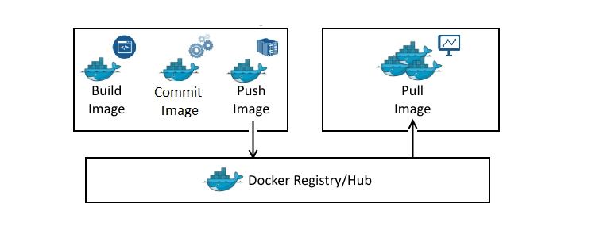
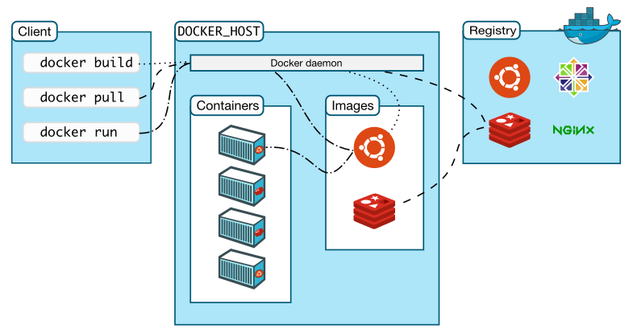

# Introduction
A **Docker container** is a is a lightweight, standalone, executable package of software that includes everything needed to run an application: code, runtime, system tools, system libraries and settings.

> Docker provides a consistent development environment: as long as every team member uses the same **docker image**, they will have available the same system libraries, and the same language runtime no matter the host machine they are using to actually develop.

There are **three stages** when creating a container:


* Writing a **dockerfile**.

* Build an docker **image** based on the **dockerfile**.

* Run the **container** based on the **image**.

Another important component of the Docker ecosystem is **Docker hub**, an online repository with thousands of images built by the community around Docker. We can **upload** there, the **images** we create, based on our own dockerfiles, and we can also **download** pre-built images from it.



## Installing Docker
In **Windows** and **macOS** systems, installing [Docker Desktop](https://www.docker.com/products/docker-desktop) is the fastest and easiest way of getting Docker in our system.

> While writing this, [Docker Desktop for Linux](https://www.docker.com/blog/accelerating-new-features-in-docker-desktop/) is not ready yet, and requires to sign up for the Developer Preview Program.

[Installation in Ubuntu](https://docs.docker.com/engine/install/ubuntu) is a bit more involved. It requires, first of all, **uninstalling old versions**:
```
sudo apt-get remove docker docker-engine docker.io containerd runc
```

Once that's done, there are two ways of installing the [Docker Engine]():

1. [Add the Docker repository to our system](https://docs.docker.com/engine/install/ubuntu/#install-using-the-repository)
2. [Download the package and install manually](https://docs.docker.com/engine/install/ubuntu/#install-from-a-package)

### Manual Installation
We went for the **second option**, and downloaded the packages from [here](https://download.docker.com/linux/ubuntu/dists/) (click on `/pool/stable`).

> If you're not sure about in what `pool` to look for packages, run `lsb_release -a` command to display your **Ubuntu version**.

Once the `.deb` files are in our filesystem, we can install using:
```
sudo dpkg -i /path/to/package.deb
```

> We have to download/install three packages: `docker-ce`, `docker-ce-cli`, and `containerd.io`.

After the installation is complete, it's probably a good idea to run the following command as a small sanity test:
```
sudo docker run hello-world
```

### Post-installation steps for Linux
The official documentation explains in detail the [post-installation steps for Linux](https://docs.docker.com/engine/install/linux-postinstall/). Since we don't want to use `sudo` every time we use the `docker` command, let's create the `docker` group and add our user to it using:
```
sudo usermod -aG docker $USER
```

> If the `docker` group doesn't exist, you may have to do `sudo groupadd docker`.

**Rebooting** our system is the last step.

Optionally, we may want to configure docker to start on reboot, although in my case, these services were already enabled:
```
sudo systemctl enable docker.service
sudo systemctl enable containerd.service
```

## Docker Architecture
When we run the `hello-world` container in the section above, we got the following output:
```
To generate this message, Docker took the following steps:
 1. The Docker client contacted the Docker daemon.
 2. The Docker daemon pulled the "hello-world" image from the Docker Hub.
    (amd64)
 3. The Docker daemon created a new container from that image which runs the
    executable that produces the output you are currently reading.
 4. The Docker daemon streamed that output to the Docker client, which sent it
    to your terminal.
```

Docker uses a [client-server model](https://en.wikipedia.org/wiki/Client%E2%80%93server_model):

* On one side we have the **Docker client**.
* On the other we have the **Docker daemon**.
* We also have to mention here **Docker Hub**, also known as **Docker Registry**.

The following diagram may help:



The **user** does not interact directly with the **Docker daemon** (`containerd`), but with the **Docker client**, which is the command `docker`. This command accepts instructions from the user and communicates back and forth with the Docker daemon. In short, the `docker` command is just an interface to the Docker daemon, which is the one that does heavy lifting of building, running, and distributing our Docker containers.

> In the diagram above, both the **Docker daemon** and the **Docker client** are running on the same system (the client connects to `DOCKER_HOST`, which is the **socket** of the machine where the daemon runs). But as we are going to see a bit later, we can also connect a Docker client to a **remote** Docker daemon, or to a daemon that lives on a **virtual machine**.

---
[:arrow_backward:][back] ║ [:house:][home] ║ [:arrow_forward:][next]

<!-- navigation -->
[home]: ../README.md
[back]: ../README.md
[next]: ./README/00_how_to_docker.md